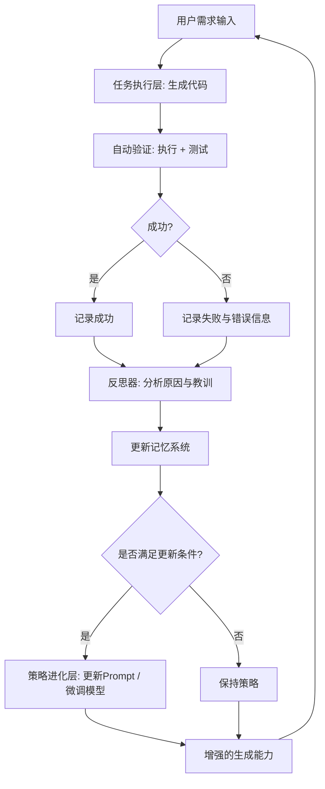

这是一个极具挑战性的研究问题，目标是构建一个**完全自主、无需外部数据或人工干预、能在任务执行过程中自我提升**的智能体系统。核心机制是“反思（Reflection）+ 记忆（Memory）+ 策略自适应（Self-Update）”的闭环循环。

---

## 一、系统目标与核心思想

### 目标：
构建一个**代码生成智能体**，在**零外部数据、零人工干预**的条件下，通过**自我反思、经验积累与策略进化**，持续提升代码生成质量（正确性、效率、可读性等）。

### 核心思想：
> **“学习即任务，任务即学习”**  
> 每一次代码生成都不是孤立的，而是系统自我进化的机会。系统通过执行、验证、反思、记忆和更新，形成**自监督的闭环学习机制**。

---

## 二、系统架构设计：三层循环架构

我们提出一个**三层循环的自进化智能体架构**：

| 层级 | 名称 | 功能 | 频率 |
|------|------|------|------|
| L1 | 任务执行层（Task Execution） | 接收需求 → 生成代码 → 执行验证 | 每次任务 |
| L2 | 反思优化层（Reflection & Memory） | 分析结果 → 提取经验 → 存储记忆 | 每次任务后 |
| L3 | 策略进化层（Policy Self-Update） | 利用记忆 → 更新生成策略 | 定期或触发式 |

> 形成：**“执行 → 反思 → 记忆 → 进化 → 更强执行”** 的飞轮。

---

## 三、核心组件与机制设计

### 1. 任务执行层（L1）：生成 + 验证 + 反馈

**输入**：自然语言需求（如“写一个快速排序”）  
**输出**：可执行代码 + 执行结果 + 性能指标

**流程**：
1. **代码生成**：基于当前策略（如 prompt + 模型权重）生成候选代码。
2. **自动验证**：
   - **功能验证**：自动生成测试用例（如基于规格、边界值、等价类）并执行。
   - **性能验证**：运行时性能（时间/空间复杂度）监测。
   - **质量评估**：语法正确性、可读性（如 pylint 评分）、复杂度（圈复杂度）等。
3. **反馈信号生成**：
   - 成功/失败标签
   - 错误类型（语法、逻辑、超时、崩溃）
   - 性能指标（运行时间、内存使用）
   - 代码质量评分

> ✅ 关键：**无需人工标注，完全自监督**。

---

### 2. 反思优化层（L2）：反思 + 记忆构建

**目标**：从单次任务中提取**可复用的经验**，构建**结构化记忆库**。

#### （1）反思机制（Reflection）

**触发条件**：每次任务完成后（无论成功或失败）

**反思内容**：
- **成功反思**：为何成功？关键设计模式？高效算法？优雅实现？
- **失败反思**：错误根因？是理解偏差？逻辑漏洞？边界遗漏？性能陷阱？
- **对比反思**：与历史成功案例的差异？是否重复犯错？

**实现方式**：
- 使用 LLM 作为“反思器”，输入：
  - 原始需求
  - 生成代码
  - 执行结果与错误信息
  - 历史相似案例（从记忆检索）
- 输出结构化反思报告，例如：

```json
{
  "task_id": "T123",
  "success": false,
  "error_type": "off-by-one",
  "root_cause": "loop boundary incorrect due to misinterpretation of 'n' as length instead of index",
  "lesson": "When iterating over array indices, always clarify whether 'n' represents length or max index",
  "suggestion": "Add assertion: assert n == len(arr) - 1",
  "similar_past_errors": ["T045", T078"],
  "pattern": "boundary_confusion"
}
```

#### （2）记忆系统（Memory）

**设计目标**：支持**经验检索、模式归纳、策略更新**

**记忆类型**：
| 类型 | 内容 | 存储形式 | 用途 |
|------|------|----------|------|
|  episodic memory（情景记忆） | 完整任务记录（需求、代码、结果、反思） | 向量数据库（如 Chroma, FAISS） | 检索相似任务 |
| semantic memory（语义记忆） | 抽象经验（模式、陷阱、最佳实践） | 结构化知识图谱或规则库 | 指导未来生成 |
| procedural memory（程序记忆） | 策略参数（如 prompt 模板、偏好设置） | 配置文件或模型参数 | 策略更新 |

**记忆构建流程**：
1. 反思报告 → 提取关键模式（如“链表操作常忘记处理空指针”）
2. 聚类相似经验 → 形成“语义记忆条目”
3. 定期归纳：从多个相似错误中提炼“通用教训”

> 示例语义记忆：
> ```
> 模式: 链表删除节点
> 常见错误: 未处理 head 被删除的情况
> 建议: 使用 dummy node 技巧
> 置信度: 0.92（基于12次错误中11次适用）
> ```

---

### 3. 策略进化层（L3）：Self-Update 机制

**目标**：利用积累的记忆，**主动更新生成策略**，提升未来表现。

#### （1）策略表示方式

策略可以是：
- **Prompt 工程**：动态调整 system prompt / few-shot examples
- **模型参数微调**：轻量级自适应（如 LoRA, Adapter）
- **生成偏好**：如“优先使用函数式编程”、“避免递归”等

> 本系统不依赖外部数据，因此**不采用大规模微调**，而是：
> - **Prompt 自适应**（主要）
> - **参数高效微调（PEFT）**（可选，若允许局部权重更新）

#### （2）策略更新机制

**触发条件**：
- 累积足够多相似记忆（如10次“边界错误”）
- 性能下降（如连续3次失败）
- 定期触发（如每50次任务）

**更新方式**：

##### 方法1：Prompt 自适应（核心）

- 从语义记忆中提取高频教训 → 生成“经验提示”
- 动态注入到 system prompt 中

**示例**：
```text
【系统提示】
你是一名代码生成专家。根据过往经验，你总结出以下教训：
- 处理数组索引时，注意区分长度与最大索引
- 链表操作务必使用 dummy node 避免头节点特殊处理
- 排序任务优先使用 Timsort（Python 内置）而非自实现
请基于这些经验生成高质量代码。
```

> ✅ 优势：无需训练，即时生效，可解释性强

##### 方法2：Few-shot 动态选择

- 从情景记忆中检索最相似的**成功案例**
- 将其作为 few-shot examples 加入 prompt

> 实现：使用向量检索（需求 embedding 相似度）

##### 方法3：参数高效微调（可选进阶）

- 使用 LoRA 等轻量级方法，在**自生成的“成功代码”数据**上微调
- 数据来源：记忆中“高置信度成功案例”
- 防止过拟合：只使用高置信度、多样化的样本

> ⚠️ 注意：虽无外部数据，但**自生成数据**仍可用于微调，属于“自我蒸馏”

---

## 四、系统运行流程（完整闭环）



---

## 五、关键技术挑战与解决方案

| 挑战 | 解决方案 |
|------|----------|
| **错误归因困难** | 使用 LLM 进行“反事实推理”：尝试修复代码并验证，定位最小错误片段 |
| **记忆爆炸** | 定期聚类与抽象，遗忘低置信度、低频记忆（可设置记忆衰减机制） |
| **策略更新不稳定** | 使用“渐进式更新”：如只添加提示，不删除旧提示；或 A/B 测试新策略 |
| **自循环陷阱** | 引入“多样性强制”：定期尝试新思路，避免陷入局部最优（如温度采样、随机 prompt 扰动） |
| **验证信号不足** | 增强验证器：使用符号执行、模糊测试（fuzzing）、静态分析工具（如 mypy, pylint） |

---

## 六、一个极简原型实现示例（基于 Python + LLM）

### 1. 组件
- **生成器**：调用 GPT-4 / Claude / Qwen 等 API
- **验证器**：Python `exec()` + 单元测试自动生成（如 `hypothesis`）
- **反思器**：LLM prompt 生成反思报告
- **记忆库**：Chroma 向量数据库 + JSON 文件存储语义记忆
- **策略管理**：动态 system prompt 管理器

### 2. 示例流程（伪代码）

```python
def generate_code(requirement):
    prompt = build_prompt(requirement)  # 包含动态经验提示
    code = llm.generate(prompt)
    return code

def validate(code, requirement):
    tests = generate_tests(requirement)
    result = run_tests(code, tests)
    return result  # {success: bool, error: str, metrics: {...}}

def reflect(requirement, code, result):
    prompt = f"""
    Task: {requirement}
    Generated Code: {code}
    Result: {result}
    Past similar errors: {retrieve_similar_errors(requirement)}
    
    Analyze why it failed/succeeded and extract a concise lesson.
    Output JSON: {"lesson": "...", "pattern": "...", "suggestion": "..."}
    """
    reflection = llm.generate(prompt)
    return json.loads(reflection)

def update_memory(reflection):
    store_episodic(reflection)
    abstracted = abstract_lesson(reflection)
    update_semantic(abstracted)

def evolve_policy():
    lessons = get_top_semantic_memories(k=10)
    new_prompt = build_experience_prompt(lessons)
    update_system_prompt(new_prompt)

# 主循环
for req in stream_of_requirements():
    code = generate_code(req)
    result = validate(code, req)
    reflection = reflect(req, code, result)
    update_memory(reflection)
    if should_evolve():
        evolve_policy()
```

---

## 七、理论支撑与相关研究

| 概念 | 相关研究 |
|------|----------|
| **反思机制** | Reflexion (Shinn et al., 2023) —— LLM 通过语言反馈自我纠正 |
| **记忆增强** | MemoryBank (Zhong et al., 2023) —— 长期记忆系统 |
| **自我改进** | Self-Refine (Madaan et al., 2023) —— 迭代自我反馈优化 |
| **代码自我修复** | Self-Debugging (Chen et al., 2023) —— 代码生成 + 执行反馈 |
| **元学习** | MAML / Learning to Learn —— 快速适应新任务（本系统为“零样本元学习”） |

> 本系统可视为 **“Reflexion + Memory + Policy Evolution”** 的集成与长期化。

---

## 八、评估指标（如何衡量“自我提升”）

| 指标 | 说明 |
|------|------|
| **成功率提升率** | 从初始到第N次任务，成功率从 60% → 85% |
| **错误重复率下降** | 同类错误不再重复（如“边界错误”从10次 → 1次） |
| **平均尝试次数** | 生成正确代码所需的轮次减少 |
| **代码质量提升** | 平均 pylint 评分、时间复杂度优化次数 |
| **记忆利用率** | 检索到的记忆被实际用于生成（prompt 中引用）的比例 |

---

## 九、未来扩展方向

1. **多智能体协作**：一个生成，一个验证，一个反思（角色分工）
2. **跨任务迁移**：将“排序”中学到的经验迁移到“搜索”任务
3. **引入强化学习**：用成功/失败作为奖励，训练策略模型（如 RLHF）
4. **神经符号结合**：将语义记忆转化为可执行规则（如程序合成）
5. **人类对齐**：即使无干预，也可隐含对齐（如通过“高质量代码”定义）

---

## 十、总结：构建自进化代码智能体的 7 步法

1. **让系统能“动”**：生成可执行代码 + 自动验证
2. **让系统能“想”**：用 LLM 反思失败与成功
3. **让系统能“记”**：构建多类型记忆系统
4. **让系统能“学”**：从记忆中抽象经验
5. **让系统能“变”**：动态更新 prompt 或轻量微调
6. **让系统能“稳”**：避免崩溃、遗忘、循环
7. **让系统能“长”**：长期运行，持续进化

---

✅ **最终愿景**：
> 部署一个代码智能体，**第一天它很普通，但第100天，它成了领域专家**——而这一切，**没有一行新训练数据，没有一次人工干预**。

这就是**真正的自我进化智能体**。