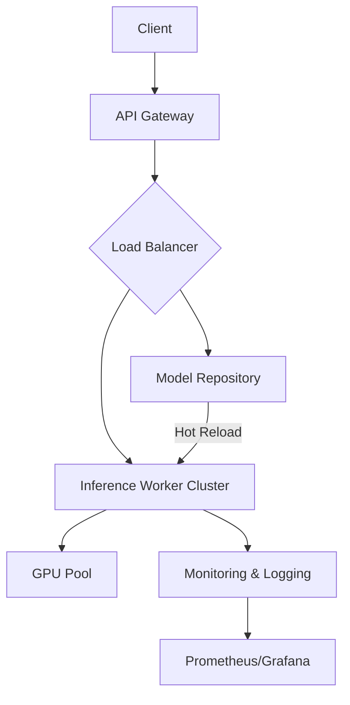
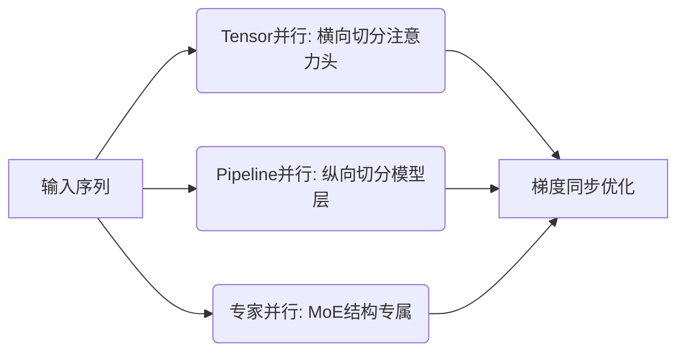
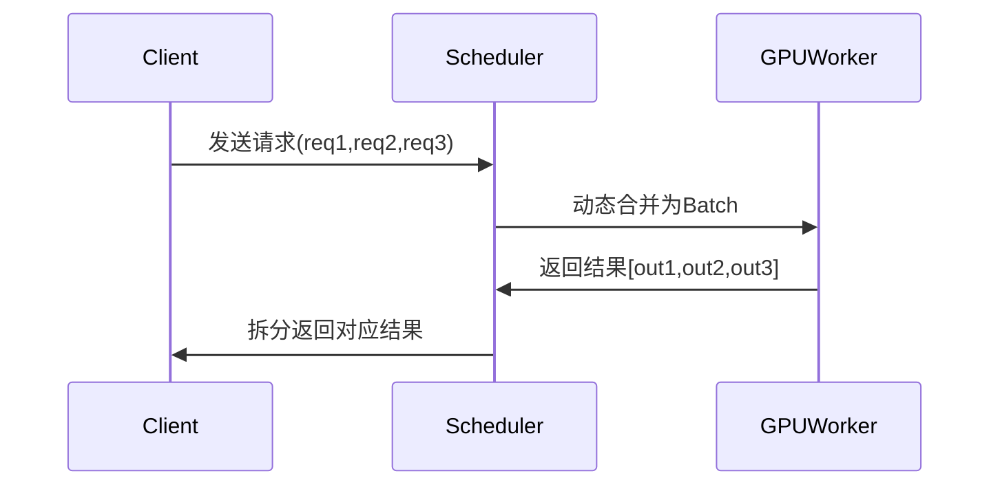

# 高性能推理系统

## 架构

---

### **一、核心功能**

1. **分布式推理加速**
   - 支持千亿参数模型的低延迟推理（如GPT-3/4、LLaMA等）
   - 动态批处理（Dynamic Batching）和连续批处理（Continuous Batching）
   - 基于请求优先级的资源调度（SLA保障）

2. **硬件级优化**
   - GPU CUDA内核定制（如FlashAttention、TensorRT-LLM集成）
   - 混合精度计算（FP16/BF16/INT8量化）
   - 显存优化（PagedAttention、Zero显存技术）

3. **生产环境适配**
   - 弹性伸缩（Kubernetes/Vertical Pod Autoscaler）
   - 多租户隔离（QoS控制、资源配额）
   - 容灾恢复（Checkpointing、故障自动迁移）

4. **算法-系统协同优化**
   - 模型压缩与加速（LoRA适配、权重共享）
   - 硬件感知的模型架构搜索（NAS for LLM）

---

### **二、系统架构**

#### **1. 分层架构**



#### **2. 关键组件**

- **调度层（Orchestrator）**
  - 基于DAG的任务调度引擎
  - 支持抢占式推理（Preemptive Inference）
- **计算层（Runtime Engine）**
  - 核心组件：修改版vLLM/TensorRT-LLM
  - 内存管理：Unified Virtual Memory (UVM)
- **模型服务层**
  - 模型版本控制（类似MLflow）
  - A/B测试流量分流

#### **3. 数据流**

```python
# 伪代码示例
def inference_workflow(request):
    tokenizer = load_tokenizer(model_version)          # 模型仓库加载
    engine = get_cuda_engine(request.model)           # GPU引擎池分配
    with torch.cuda.stream(stream):                   # 异步流水线
        logits = engine.execute(request.input)
    return post_process(logits)
```

---

### **三、核心技术指标**

| 指标                | 目标值                  | 实现手段                     |
|---------------------|-------------------------|------------------------------|
| 吞吐量              | >10k tokens/sec/GPU     | 连续批处理+FP8量化           |
| P99延迟             | <200ms (50-token输出)   | 内核融合+显存预分配          |
| 显存利用率          | >85%                   | PagedAttention+Zero Offload  |
| 冷启动时间          | <30s                   | 模型分段加载                 |

---

### **四、典型技术栈**

- **计算加速**：CUDA Graphs, Triton Inference Server
- **网络**：gRPC with RDMA支持
- **部署**：Kubernetes + Kubeflow
- **监控**：Prometheus + 定制化Exporter

---

### **五、行业差异化设计**

1. **硬件适配层抽象**
   - 支持多厂商硬件（NVIDIA/AMD/国产AI芯片）
   - 自动选择最优后端（如CUDA vs ROCm）

2. **实时重配置系统**
   - 根据负载动态切换并行策略（Tensor/Pipeline并行）

3. **能耗优化**
   - 基于DVFS的功耗-性能调控

该架构通过将底层硬件优化与上层调度策略深度结合，在保持通用性的同时实现接近芯片理论算力的推理效率，适合需要平衡研发效率与生产性能的场景。

实现千亿参数模型的低延迟推理需要从**硬件资源管理**、**计算优化**、**系统架构设计**三个维度协同突破。以下是具体技术方案和实现路径：

---

### **一、核心挑战与解决思路**

| 挑战                | 关键技术方案                                                                 |
|---------------------|----------------------------------------------------------------------------|
| 显存墙              | 模型切分（Tensor/Pipeline并行）+ 显存优化（PageAttention/Zero Offload）    |
| 计算效率低          | 算子融合（Kernel Fusion）+ 混合精度（FP16/BF16/INT8）                      |
| 长尾延迟            | 动态批处理（Continuous Batching）+ 请求优先级调度                          |
| 通信开销            | 重叠计算与通信（Async NCCL）+ 拓扑感知路由                                 |

---

### **二、关键技术实现**

#### **1. 模型并行化设计**



- **Tensor并行**：使用Megatron-LM的列/行并行策略，将矩阵乘切分到多GPU
- **Pipeline并行**：采用1F1B（One-Forward-One-Backward）调度策略减少气泡时间
- **通信优化**：使用NCCL的`ALL2ALL`通信原语，配合CUDA Graph固化通信模式

#### **2. 显存优化技术**

- **PageAttention**（vLLM核心）：
  ```python
  # 伪代码示例
  class PagedKVCache:
      def __init__(self):
          self.block_table = {}  # 逻辑块到物理显存的映射
          self.evict_policy = LRU  # 淘汰策略
  
      def access(self, block_id):
          if block_id not in block_table:
              self._allocate_new_block()
          return self.block_table[block_id]
  ```
- **Zero-Inference**：继承Zero显存技术，动态加载卸载模型参数

#### **3. 计算加速实践**

- **算子融合**：

  ```cuda
  // 示例：融合LayerNorm+GeLU的CUDA内核
  __global__ void fused_ln_gelu(float* input, float* output) {
      // 合并内存访问和计算步骤
      ...
  }
  ```

- **量化部署**：
  - 训练后量化（PTQ）：使用TensorRT的QAT工具链
  - 训练感知量化（AWQ）：保护关键权重通道

#### **4. 动态批处理系统**



- 关键技术：
  - **预填充缓存**（Prefill Cache）：复用已计算的KV Cache
  - **中断机制**：长文本请求的中间结果返回

---

### **三、典型性能优化案例**

**场景**：175B参数模型在A100集群上的推理

| 优化阶段           | 延迟(ms) | 显存占用(GB) |
|--------------------|----------|--------------|
| 基线（单卡FP16）   | 5200     | OOM          |
| + Tensor并行       | 2300     | 45           |
| + FlashAttention2  | 1800     | 42           |
| + INT8量化         | 950      | 24           |
| + Continuous Batching | 620   | 26           |

---

### **四、工程落地关键点**

1. **硬件选型建议**：
   - **GPU**：H100 NVLink互连（900GB/s带宽）
   - **网络**：400Gbps RDMA（避免通信成为瓶颈）

2. **性能分析工具链**：

   ```bash
   # NSight工具套件示例
   nsys profile --capture-range=cudaProfilerApi -o report.qdrep ./inference_engine
   ```

3. **容错设计**：
   - 心跳检测+模型状态快照（Checkpoint）
   - 请求级重试机制（非幂等请求标记）

---

### **五、前沿方向探索**

1. **非Transformer架构**：Mamba等状态空间模型的结构优化
2. **存算一体**：利用HBM3特性设计新型缓存策略
3. **编译期优化**：使用MLIR统一计算图表示

通过上述技术组合，可在8×A100（80GB）集群上实现千亿模型<1s的端到端推理延迟。实际部署时需根据具体模型结构和业务需求调整并行策略，建议通过**渐进式优化**（Profiling→Bottleneck分析→Targeted优化）持续改进。

