# 提高RAG回复准确性和质量

---

## 一、文档预处理与切分流程（提升召回阶段质量）

RAG 的第一步是检索，检索质量直接影响最终答案质量。针对超长文档，应采用系统的预处理和切分策略：

### ✅ 1. 文档清洗（清理无用信息）

* 删除页眉页脚、目录索引、版权信息等冗余内容。
* 标准化格式（比如统一标题格式、清除乱码等）。

### ✅ 2. 文档结构解析（构建语义层次）

* 使用规则或模型提取结构化信息，如：

  * 一级标题、二级标题（H1、H2...）
  * 表格、列表、段落、引用等
* 形成树状结构（文档章节树），用于后续切分中的“语义归属”。

### ✅ 3. 智能切分策略（Chunking）

为了既保证 chunk 不过长，又保留语义完整性：

| 切分方式           | 说明                                                         |
| -------------- | ---------------------------------------------------------- |
| 基于标题切分         | 按章节标题或小节断点切分，保证上下文完整（适用于结构化文档）                             |
| Sliding Window | 滑动窗口策略，加入重叠区域（如每段 overlap 20-30%，防止信息断裂）                   |
| 基于语义句元切分       | 使用 NLP 工具（如 SpaCy、NLTK）按句、段落、语义断点切分                        |
| Token 限制切分     | 控制每段 chunk 的 token 数量（如 500\~800 token），保证适配向量模型和 LLM 输入限制 |

> ⚠️建议使用**递归文本切分器 Recursive Text Splitter（LangChain 提供）**：从段落 → 句子 → 词层级进行智能切分，保证语义尽可能完整。

### ✅ 4. 元数据增强（Metadata Tagging）

每个 chunk 附带以下元信息，用于后续过滤与 rerank：

* 所属章节路径（如“第3章 > 小节2 > 段落4”）
* 文档名称、页码、日期等
* 可选关键词、主题标签、文档来源等

---

## 二、向量索引构建与检索优化（提升匹配阶段质量）

### ✅ 1. 向量模型选择

* 建议使用开源语义向量模型如：

  * `bge-large-en` / `bge-m3`（中文用 `bge-large-zh`）
  * `E5` 系列：`intfloat/e5-large`
  * `GTE-base`（轻量化高性能）

### ✅ 2. Embedding 构建

* 对上述切分后的 chunk 做 embedding 向量化。
* 可用 `FAISS` / `Milvus` / `Weaviate` 等构建向量数据库。

### ✅ 3. 向量检索优化

* 使用 hybrid search（向量 + BM25）、多路召回（embedding + keyword）、添加 rerank（cross encoder 模型）。
* 针对查询问题：

  * Query Expansion：对用户 query 做 paraphrasing 或加 keyword。
  * Query-Document Alignment：通过 reranker 模型计算 query 与文档块之间的跨语义匹配。

---

## 三、生成阶段优化（提升回答准确性）

### ✅ 1. Prompt 构造技巧

* 加入提示词让 LLM 聚焦于给定 context，不“编造”：

```text
请仅根据提供的资料回答，不要添加外部信息。若无法确定，请回答“无法确定”。
资料如下：
{retrieved_chunks}
问题：{user_question}
```

### ✅ 2. 多段信息融合

* 若检索出多个相关 chunk，可：

  * 合并摘要后输入 LLM
  * 用 `Map-Reduce` 或 `Refine` 策略生成答案

### ✅ 3. 引用链与来源可追溯性

* 保留回答中使用的 chunk 来源路径，供用户验证。

---

## 四、可选提升点

* **使用 LLM 或规则生成“摘要”embedding**，替代全文 embedding，提高语义覆盖度。
* **构建多粒度索引**：段落级 + 小节级，层级检索。
* **使用结构化问答模块（如 LangChain QAChain）**，支持“问答记忆”和上下文窗口管理。
* **评估模块嵌入**：搭配评估器自动判断答案是否命中知识、是否 hallucination。

---
# Query Expansion（查询扩展）
是提升检索召回率与语义匹配度的有效手段。它的目标是把用户原始查询进行**重写（paraphrasing）或拓展（添加关键词）**，使其能更好地匹配到文档中的表述方式。

---

## 🔍 为什么需要 Query Expansion？

用户的问题往往**表达方式不一致**，而文档中可能使用不同的说法。例如：

* 用户问：**“这款产品的优点有哪些？”**
* 文档说：**“该设备的优势包括…”**、“具有以下特点…”

通过对原始查询进行语义改写或关键词拓展，可以提升检索系统的**召回能力**与**向量匹配度**。

---

## 🧠 Query Expansion 的两类方式

### ✅ 方式一：Paraphrasing（查询重写）

> 将原始问题生成多个语义相似但表达方式不同的变体。

#### 方法：

* 使用 LLM 进行 query 改写，如：

```text
请改写下列问题，使其表达不同但含义一致：
原始问题：{user_query}
输出3种不同表达方式。
```

* 示例：

  ```
  原始：学生在校期间可以申请哪些奖学金？
  扩展：
  1. 在读学生有哪些奖助金可以申报？
  2. 学校提供哪些奖学金供学生申请？
  3. 本科生可获得哪些资助项目？
  ```

#### 应用方式：

* 将改写后的 query 一起去做向量 embedding → 扩展检索召回范围。
* 或用它们单独去查询关键词索引、BM25等。

---

### ✅ 方式二：Keyword Injection（关键词注入）

> 为原始 query 添加可能出现于文档中的“关键词”或“同义词”以增强召回。

#### 方法一：利用领域词库（推荐）

* 针对特定领域（如医学、教育、金融），维护一个**关键词同义词词典**，进行 query 拓展。
* 示例：

  * 输入：“疾病的传播方式有哪些？”
  * 扩展关键词：**“传播途径”**, “感染路径”, “传染方式”等

#### 方法二：使用 LLM 抽取关键词并拓展

```text
请提取下列问题中的核心关键词，并提供3个可能的同义或相关词：
问题：{user_query}
输出格式：关键词 - 同义词1, 同义词2, 同义词3
```

#### 方法三：Embedding-based Keyword Matching

* 对 query 做 embedding，与一个包含关键词的向量词典进行相似度计算，找到 semantically close 的 keyword。

---

## 🛠️ 集成 Query Expansion 到 RAG 流程

```mermaid
graph LR
Q[原始用户Query] -->|LLM改写/关键词注入| QE[扩展后的Query集]
QE -->|Embedding| VecQ[Query向量]
VecQ -->|相似度计算| R[文档块召回]
R -->|上下文拼接| G[LLM生成答案]
```



### 示例代码框架（伪代码）：

```python
def expand_query_with_llm(query):
    prompt = f"请改写下列问题，使表达不同但含义一致：{query}"
    paraphrases = call_openai(prompt)
    return [query] + paraphrases

def expand_query_with_keywords(query):
    keywords = extract_keywords_with_llm_or_dict(query)
    expanded_queries = [f"{query} {kw}" for kw in keywords]
    return [query] + expanded_queries

def get_expanded_embeddings(queries, embed_model):
    return [embed_model.encode(q) for q in queries]

def retrieve_chunks(expanded_embeddings, vector_store):
    return vector_store.search(expanded_embeddings, top_k=3)

# 整合到 RAG
expanded_queries = expand_query_with_llm(user_query)
query_embeddings = get_expanded_embeddings(expanded_queries, embed_model)
retrieved_chunks = retrieve_chunks(query_embeddings, faiss_index)
```

---

## 🧪 实践建议

| 场景            | 推荐方式                                   |
| ------------- | -------------------------------------- |
| 通用问答          | LLM 改写 + 基本关键词提取                       |
| 教育、金融、法律等垂直领域 | 使用领域词典 + BM25 keywords                 |
| 性能敏感（需快）      | 仅扩展 1\~2 个 paraphrase + fast embedding |
| 准确性要求高        | rerank 扩展后召回结果，避免过多噪声                  |

---

# 基于对话历史上下文的 Query Expansion
是在**多轮对话**或交互式问答场景中极为重要的一种策略，尤其适用于以下几类情况：

* 用户提问简略甚至省略主语（如“它什么时候开始？”）
* 用户在连续提问同一主题（如“上一个项目的预算是多少？那它什么时候启动？”）
* 用户的 query 存在上下文依赖（如“再帮我查一下它的功能”）

---

## 📌 一、什么是基于上下文的 Query Expansion？

它的核心思想是：**将当前用户提问结合历史对话上下文进行补全或重写**，以生成一个“上下文自洽”的完整 query，使得检索与生成更准确。

---

## 🧠 关键实现思路

### ✅ 1. 历史对话状态建模

对历史消息进行建模，提取必要的上下文信息，例如：

* 最近一次提及的主题/实体（“这个项目”指代哪个？）
* 历史问题和回答的内容摘要
* 用户当前问题中的省略语义

### ✅ 2. 上下文补全 / 改写（Contextual Rewriting）

#### 方法一：使用 LLM 进行上下文重写

```text
你是一个问答助手，请根据历史对话和用户当前问题，生成一个完整清晰的查询问题。

历史对话：
Q1: 请介绍一下Taurus项目。
A1: Taurus项目是一个用于自动化测试的数据平台...
Q2: 它什么时候上线？

→ 输出：Taurus项目是什么时候上线的？
```

#### 方法二：检索+规则补全

* 利用 last topic/entity tracking + query template，快速拼接成完整查询句
* 常见策略：

  * 抽取上一次实体：如“它” → 最近一次提到的“xxx项目”
  * 跟踪主题 thread：如“再帮我看一下那个API”，可推断为上轮提到的接口

---

## 🧰 实现模块建议（组件化）

### 模块 1：历史上下文摘要器（可选）

```python
def summarize_history(dialogue_turns):
    return LLM("请总结以下对话中的主题实体：", dialogue_turns)
```

### 模块 2：上下文增强 Query Rewriter

```python
def rewrite_query_with_context(history, current_query):
    prompt = f"""
    根据以下对话历史和当前问题，改写为一个清晰、完整、上下文无歧义的问题：

    对话历史：
    {history}

    当前问题：
    {current_query}

    改写后的问题：
    """
    return call_openai(prompt)
```

### 模块 3：集成到 RAG 查询流程

```python
# Step 1: 上下文改写
full_query = rewrite_query_with_context(dialogue_history, user_query)

# Step 2: query expansion（paraphrase + keyword）
expanded_queries = expand_query_with_llm(full_query)

# Step 3: 向量检索 + RAG
```

---

## 🧪 应用效果举例

### 原始对话：

```
Q: 请介绍一下Neo系统。
A: Neo系统是为内部员工设计的协作平台。

Q: 它支持哪些功能？
```

### 重写后 query：

```
Neo系统支持哪些功能？
```

这样才能在向量检索中找到包含“Neo系统功能介绍”的段落，而不会错召“它”指向其他内容。

---

## ✅ 总结：Query Expansion 的三层合成策略

| 层级    | 内容类型                       | 是否依赖上下文 |
| ----- | -------------------------- | ------- |
| 语义改写  | Paraphrasing               | 否       |
| 关键词扩展 | Synonym / Related Terms    | 否       |
| 上下文补全 | Contextual Query Rewriting | ✅ 是     |

---
