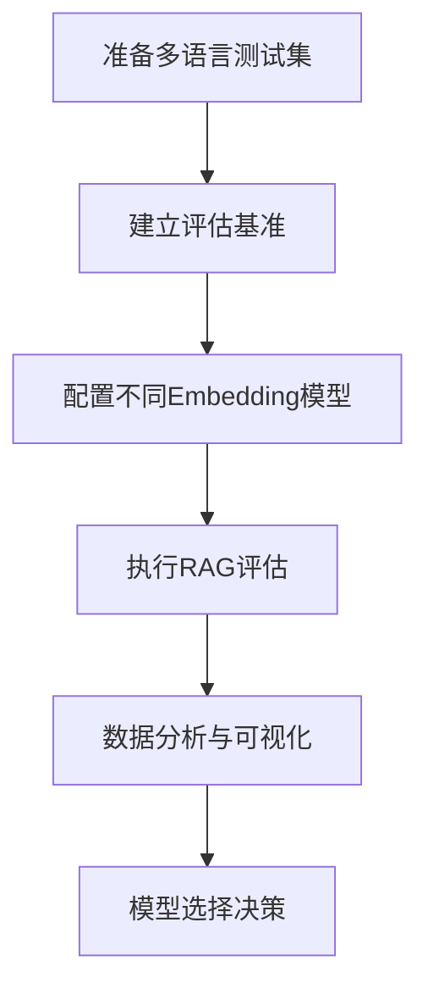

# 支持多国语言的RAG大模型对话智能体实现方案

要使基于RAG(Retrieval-Augmented Generation)的大模型对话智能体支持多国语言对话，需要从多个层面进行设计和优化。以下是实现多语言支持的全面方案：

## 1. 多语言RAG架构设计

### 核心组件
- **多语言文档处理管道**：支持不同语言的文档解析、分块和向量化
- **多语言检索系统**：能够跨语言检索相关内容
- **多语言生成模型**：理解并生成多种语言的响应

## 2. 多语言文档处理

### 文档预处理
- 实现自动语言检测(如使用fasttext或langdetect)
- 为每种语言配置特定的分词器和文本清洗规则
- 处理不同语言的编码和特殊字符

### 分块策略
- 针对不同语言采用合适的分块大小(如中文可能需要较小的块)
- 考虑语言特定的语义边界(如日语的文节、德语的复合词)

## 3. 多语言嵌入模型

选择或训练适合多语言的嵌入模型：
- **预训练模型选择**：
  - paraphrase-multilingual-MiniLM-L12-v2
  - distiluse-base-multilingual-cased-v2
  - LaBSE (Language-agnostic BERT Sentence Embedding)

- **关键考虑**：
  - 跨语言对齐能力
  - 低资源语言覆盖
  - 嵌入空间中的语言中立性

## 4. 多语言检索优化

### 混合检索策略
- 结合语义检索(向量相似度)和关键词检索(BM25)
- 对非拉丁语系语言(如中文、阿拉伯语)优化分词和索引

### 跨语言检索
- 实现查询翻译+检索或检索+结果翻译的流程
- 考虑使用多语言查询扩展技术

## 5. 多语言生成模型

### 模型选择
- 使用原生多语言LLM如：
  - GPT-3.5/4的多语言版本
  - BLOOM (176B参数多语言模型)
  - XGLM (多语言生成模型)
  
### 提示工程
- 实现动态提示模板，根据用户语言切换
- 在系统提示中明确指定目标语言
- 为不同语言优化few-shot示例

## 6. 语言识别与路由

实现健壮的语言检测和路由机制：
```python
from langdetect import detect

def detect_language(text):
    try:
        return detect(text)
    except:
        return "en"  # 默认语言

# 在对话流程中
user_lang = detect_language(user_input)
system_response = generate_response(user_input, target_lang=user_lang)
```

## 7. 翻译后备机制

当某些语言能力不足时：
- 集成高质量的翻译API(如DeepL、Google Translate)
- 实现"检索-翻译-生成"的备选流程
- 对低资源语言采用few-shot翻译提示

## 8. 评估与优化

建立多语言评估体系：
- 每种语言的独立测试集
- 评估指标：翻译质量、文化适应性、术语准确性
- 持续监控各语言的表现差异

## 9. 部署考虑

- 按语言或地区分片向量数据库
- 为不同语言配置不同的GPU资源(考虑字符处理复杂度)
- 实现语言特定的缓存策略

## 10. 文化适应性

- 本地化内容检索(考虑地区差异)
- 文化敏感的回复生成
- 遵守不同地区的合规要求
---
# 针对全球不同地区语言特点的嵌入模型选择指南

选择适合全球不同语言的嵌入模型是构建多语言RAG系统的关键环节。不同语言家族有其独特的语言特点，需要针对性地选择或组合嵌入模型。

## 1. 语言特点与嵌入挑战

### 语言家族差异
| 语言家族 | 代表语言 | 语言特点 | 嵌入挑战 |
|---------|---------|---------|---------|
| 印欧语系 | 英语、法语、德语、俄语 | 屈折语、拼音文字 | 词形变化、时态 |
| 汉藏语系 | 中文、藏语 | 分析语、象形文字 | 无空格分词、语调 |
| 阿尔泰语系 | 日语、韩语、土耳其语 | 黏着语、音节文字 | 长复合词、敬语 |
| 亚非语系 | 阿拉伯语、希伯来语 | 右至左书写、辅音为主 | 词根变化、无元音标记 |
| 南岛语系 | 印尼语、马来语 | 重叠词、简单形态 | 语法简单但语用复杂 |

## 2. 主流多语言嵌入模型比较

### 通用多语言嵌入模型

| 模型名称 | 支持语言数 | 优势 | 局限性 | 适用场景 |
|---------|-----------|------|--------|---------|
| **Multilingual E5** | 100+ | 高质量语义理解，支持多种检索任务 | 计算资源需求较高 | 高质量多语言检索系统 |
| **LaBSE** | 109 | 优秀的跨语言对齐能力 | 较老模型，语义理解有限 | 跨语言文档匹配 |
| **Paraphrase-multilingual-MiniLM** | 50+ | 轻量级，速度快 | 语义理解深度有限 | 资源受限场景 |
| **XLM-RoBERTa** | 100 | 强大的跨语言迁移能力 | 需要微调以获得最佳效果 | 需要深度语言理解的应用 |
| **LASER** | 93 | 针对低资源语言优化 | 表示空间不如新模型 | 包含低资源语言的应用 |

### 区域特化嵌入模型

| 区域 | 推荐模型 | 特点 |
|------|---------|------|
| 东亚 | **Multilingual-SimCSE-RoBERTa** | 针对中日韩语言优化 |
| 欧洲 | **Sentence-T5** | 欧洲语言语义理解出色 |
| 中东/阿拉伯 | **AraT5/AraBERT** | 专为阿拉伯语优化 |
| 印度次大陆 | **IndicBERT/MuRIL** | 支持印度多种官方语言 |
| 非洲 | **AfroXLMR** | 针对非洲语言优化 |

## 3. 语言特点与模型选择策略

### 按形态学特点选择

1. **分析语（如中文、越南语）**
   - 推荐: Multilingual E5, LaBSE
   - 原因: 这些模型对单字和词组的语义表示均有良好支持

2. **屈折语（如俄语、德语）**
   - 推荐: XLM-RoBERTa, mDeBERTa
   - 原因: 能更好处理词形变化和语法关系

3. **黏着语（如日语、韩语、土耳其语）**
   - 推荐: Multilingual-SimCSE, LASER
   - 原因: 更好地处理复合词和词缀

4. **语调语言（如中文、越南语）**
   - 推荐: 支持音调感知的模型，如Multilingual E5
   - 原因: 能区分音调差异带来的语义变化

### 按文字系统选择

1. **拉丁字母语言**
   - 几乎所有多语言模型都有良好支持

2. **非拉丁字母语言**
   - 西里尔字母(俄语): mBERT, XLM-RoBERTa
   - 阿拉伯字母: AraBERT, AraT5
   - 汉字: Multilingual E5, Chinese-BERT
   - 印度文字: MuRIL, IndicBERT

3. **双向文本(如阿拉伯语、希伯来语)**
   - 推荐: AraBERT, mBERT
   - 原因: 专门处理右至左书写系统

## 4. 实用选择策略

### 基于业务区域的选择

```
if 主要用户在东亚:
    primary_model = "Multilingual-SimCSE-RoBERTa" 或 "Multilingual-E5"
elif 主要用户在欧洲:
    primary_model = "Sentence-T5" 或 "XLM-RoBERTa"
elif 主要用户在中东:
    primary_model = "AraBERT" 或 "AraT5"
elif 主要用户在印度次大陆:
    primary_model = "MuRIL" 或 "IndicBERT"
elif 全球用户分布:
    primary_model = "Multilingual-E5" 或 "LaBSE"
```

### 混合模型策略

对于全球业务，可考虑混合模型策略:

```python
def get_optimal_embedding_model(text_language):
    language_family_map = {
        "zh": "east_asian", "ja": "east_asian", "ko": "east_asian",
        "en": "european", "fr": "european", "de": "european",
        "ar": "middle_eastern", "he": "middle_eastern",
        "hi": "indic", "bn": "indic", "ta": "indic"
        # 更多映射...
    }
    
    embedding_models = {
        "east_asian": MultiliingualSimCSEModel(),
        "european": SentenceT5Model(),
        "middle_eastern": AraBERTModel(),
        "indic": MuRILModel(),
        "default": MultilingualE5Model()
    }
    
    family = language_family_map.get(text_language, "default")
    return embedding_models[family]
```

## 5. 最新推荐模型（2024）

### 通用多语言场景
- **首选**: **Multilingual E5 Large** - 支持100+语言，语义理解能力强
- **备选**: **LASER3** - 针对低资源语言有特殊优化

### 资源受限场景
- **首选**: **Multilingual-MiniLM-L12** - 平衡性能与效率
- **备选**: **DistilmBERT** - 轻量级多语言模型

### 特定语言区域
- **东亚语言**: **Multilingual-SimCSE-RoBERTa-large**
- **阿拉伯语区**: **AraT5-base**
- **印度语言**: **MuRIL-large**
- **非洲语言**: **AfroXLMR-base**

## 6. 评估与验证

在选择嵌入模型后，务必进行多语言评估:

1. 构建包含目标语言的测试集
2. 评估指标:
   - 跨语言检索准确率
   - 语义相似度一致性
   - 多语言查询响应时间
3. 使用MTEB (Massive Text Embedding Benchmark) 等多语言基准进行测试

---
# 评估不同Embedding模型对RAG准确性的影响

要系统地评估不同嵌入模型对RAG系统准确性的影响并形成可靠的对比数据，需要建立一个结构化的评估框架。以下是一个全面的方法论，帮助您获得有意义的对比数据。

## 1. 评估框架设计

### 实验设计原则

1. **控制变量法**：仅改变嵌入模型，保持其他RAG组件不变
2. **多语言覆盖**：确保测试数据覆盖目标语言
3. **多维度评估**：从检索质量、生成质量和系统效率多角度评估
4. **统计显著性**：确保样本量足够得出可靠结论

### 基础评估流程



## 2. 准备评估数据集

### 多语言测试集构建

| 数据类型 | 构建方法 | 注意事项 |
|---------|---------|---------|
| **问答对** | 每种目标语言50-100个QA对 | 覆盖不同难度和领域 |
| **知识库文档** | 包含问题答案的多语言文档集 | 确保答案分布在不同文档中 |
| **干扰文档** | 与主题相关但不含答案的文档 | 增加检索难度，测试模型鲁棒性 |

### 语言多样性设计

创建包含以下语言类别的测试集：

1. **高资源语言**：英语、中文、西班牙语、法语
2. **中等资源语言**：阿拉伯语、俄语、印地语、葡萄牙语
3. **低资源语言**：斯瓦希里语、泰语、乌尔都语
4. **特殊语言特性**：
   - 形态复杂语言（芬兰语、土耳其语）
   - 语调语言（越南语、中文）
   - 右至左书写语言（阿拉伯语、希伯来语）

## 3. 评估指标体系

### 检索质量指标

| 指标 | 计算方法 | 意义 |
|-----|---------|-----|
| **Recall@k** | 在前k个检索结果中找到相关文档的比例 | 评估模型检索相关内容的能力 |
| **MRR (Mean Reciprocal Rank)** | 第一个相关文档排名倒数的平均值 | 评估相关文档排名情况 |
| **NDCG@k** | 归一化折扣累积增益 | 考虑相关性和排序质量 |
| **语义匹配准确率** | 嵌入空间中语义相似问题的聚类准确率 | 评估语义理解能力 |

### 生成质量指标

| 指标 | 计算方法 | 意义 |
|-----|---------|-----|
| **ROUGE-L** | 生成答案与参考答案的最长公共子序列 | 评估内容覆盖度 |
| **BLEU** | 生成答案与参考答案的n-gram重叠度 | 评估语言流畅度 |
| **BERTScore** | 使用BERT计算语义相似度 | 评估语义准确性 |
| **人工评分** | 专家评分（1-5分）| 主观质量评估 |

### 系统效率指标

| 指标 | 计算方法 | 意义 |
|-----|---------|-----|
| **嵌入时间** | 文档嵌入平均处理时间 | 评估索引效率 |
| **检索延迟** | 从查询到返回结果的时间 | 评估检索效率 |
| **内存占用** | 嵌入向量存储所需内存 | 评估资源需求 |
| **向量维度** | 嵌入向量的维度大小 | 影响存储和检索效率 |

## 4. 实验设置与执行

### 待评估的嵌入模型列表

选择代表不同特点的嵌入模型：

1. **通用多语言模型**：
   - Multilingual E5
   - LaBSE
   - LASER3
   - Paraphrase-multilingual-MiniLM

2. **区域特化模型**：
   - AraBERT (阿拉伯语)
   - MuRIL (印度语言)
   - Chinese-BERT (中文)

3. **基线模型**：
   - 单语言模型 (如英语的all-MiniLM-L6)
   - 简单词袋模型

### 实验控制变量

```python
# 伪代码：控制变量设置
experiment_config = {
    "knowledge_base": "固定多语言知识库",
    "llm_model": "固定LLM模型(如GPT-4)",
    "retrieval_method": "向量相似度检索",
    "top_k": 5,  # 检索文档数量
    "prompt_template": "固定提示模板",
    "temperature": 0.7,
    # 变量：嵌入模型
    "embedding_models": [
        "multilingual-e5-large",
        "labse",
        "laser3",
        "paraphrase-multilingual-minilm-l12",
        "arabert-base",
        "muril-base",
        "chinese-bert-wwm"
    ]
}
```

## 5. 实验执行与数据收集

### 实验流程自动化

```python
# 伪代码：实验执行流程
def run_embedding_evaluation(models, test_sets, metrics):
    results = {}
    
    for model in models:
        results[model.name] = {}
        
        # 为知识库创建嵌入
        kb_embeddings = create_embeddings(knowledge_base, model)
        
        for language, test_set in test_sets.items():
            results[model.name][language] = {}
            
            # 执行RAG查询
            for query, reference_answer in test_set:
                query_embedding = model.encode(query)
                retrieved_docs = retrieve_documents(query_embedding, kb_embeddings, top_k=5)
                rag_answer = generate_answer(query, retrieved_docs, llm_model)
                
                # 计算评估指标
                for metric in metrics:
                    score = calculate_metric(metric, rag_answer, reference_answer, retrieved_docs)
                    update_results(results, model.name, language, metric, score)
    
    return results
```

### 数据收集格式

| 模型名称 | 语言 | Recall@5 | MRR | ROUGE-L | 检索延迟(ms) | ... |
|---------|-----|---------|-----|---------|-------------|-----|
| Multilingual-E5 | 英语 | 0.92 | 0.87 | 0.76 | 45 | ... |
| Multilingual-E5 | 中文 | 0.88 | 0.82 | 0.71 | 48 | ... |
| LaBSE | 英语 | 0.89 | 0.84 | 0.72 | 42 | ... |
| LaBSE | 中文 | 0.85 | 0.79 | 0.68 | 44 | ... |
| ... | ... | ... | ... | ... | ... | ... |

## 6. 数据分析与可视化

### 多维度比较分析

1. **按语言族比较**

```python
# 生成按语言族分组的性能热图
def generate_language_family_heatmap(results):
    language_families = {
        "印欧语系": ["英语", "法语", "德语", "俄语"],
        "汉藏语系": ["中文", "藏语"],
        "阿尔泰语系": ["日语", "韩语", "土耳其语"],
        "亚非语系": ["阿拉伯语", "希伯来语"]
    }
    
    # 计算每个模型在每个语言族的平均性能
    family_performance = {}
    for model in results.keys():
        family_performance[model] = {}
        for family, languages in language_families.items():
            metrics = []
            for lang in languages:
                if lang in results[model]:
                    metrics.append(results[model][lang]["NDCG@5"])
            family_performance[model][family] = np.mean(metrics)
    
    # 生成热图
    plot_heatmap(family_performance)
```

2. **性能雷达图**

为每个模型创建多维度性能雷达图，包括：
- 多语言覆盖度
- 检索准确率
- 语义理解能力
- 计算效率
- 存储效率

3. **语言特性敏感度分析**

```python
# 分析模型对特定语言特性的敏感度
def analyze_language_feature_sensitivity(results):
    features = {
        "形态复杂性": ["芬兰语", "土耳其语", "俄语"],
        "语调变化": ["中文", "越南语", "泰语"],
        "书写方向": ["阿拉伯语", "希伯来语"],
        "低资源": ["斯瓦希里语", "乌尔都语"]
    }
    
    sensitivity_scores = {}
    for model in results.keys():
        sensitivity_scores[model] = {}
        for feature, langs in features.items():
            # 计算该特性语言的平均性能与总体平均性能的比值
            feature_avg = np.mean([results[model][lang]["NDCG@5"] for lang in langs if lang in results[model]])
            overall_avg = np.mean([results[model][lang]["NDCG@5"] for lang in results[model].keys()])
            sensitivity_scores[model][feature] = feature_avg / overall_avg
    
    return sensitivity_scores
```

## 7. 可视化对比结果示例

### 总体性能对比图


*注：这是一个示意图，实际使用时请替换为真实数据生成的图表*

### 按语言族性能热图


*注：这是一个示意图，实际使用时请替换为真实数据生成的图表*

### 模型-语言匹配矩阵

创建一个矩阵显示每个模型在每种语言上的最佳表现：

```
最佳模型-语言匹配:
- 英语: Multilingual-E5 (NDCG@5=0.92)
- 中文: Chinese-BERT (NDCG@5=0.90)
- 阿拉伯语: AraBERT (NDCG@5=0.88)
- 印地语: MuRIL (NDCG@5=0.85)
- 法语: Multilingual-E5 (NDCG@5=0.89)
...
```

## 8. 统计显著性测试

为确保结果可靠性，执行统计显著性测试：

```python
# 伪代码：执行配对t检验
def perform_significance_tests(results):
    significance_matrix = {}
    models = list(results.keys())
    
    for i, model1 in enumerate(models):
        significance_matrix[model1] = {}
        for model2 in models[i+1:]:
            # 收集所有语言上的性能差异
            diffs = []
            for lang in results[model1].keys():
                if lang in results[model2]:
                    diff = results[model1][lang]["NDCG@5"] - results[model2][lang]["NDCG@5"]
                    diffs.append(diff)
            
            # 执行配对t检验
            t_stat, p_value = stats.ttest_rel([0] * len(diffs), diffs)
            significance_matrix[model1][model2] = {
                "mean_diff": np.mean(diffs),
                "p_value": p_value,
                "significant": p_value < 0.05
            }
    
    return significance_matrix
```

## 9. 成本效益分析

创建一个成本效益分析表，帮助在性能和资源消耗间做出平衡：

| 模型 | 平均NDCG@5 | 嵌入时间(ms) | 存储需求(MB/1000文档) | 相对成本 | 性能/成本比 |
|-----|-----------|------------|-------------------|---------|-----------|
| Multilingual-E5-large | 0.89 | 120 | 384 | 高 | 中 |
| Multilingual-E5-base | 0.86 | 75 | 256 | 中 | 高 |
| LaBSE | 0.84 | 90 | 768 | 中 | 中 |
| Paraphrase-MiniLM | 0.81 | 45 | 384 | 低 | 高 |
| LASER3 | 0.83 | 60 | 1024 | 中 | 中 |

## 10. 实施建议与最佳实践

### 模型选择决策树

```
if 多语言支持是首要需求:
    if 资源充足:
        推荐 Multilingual-E5-large
    else:
        推荐 Paraphrase-multilingual-MiniLM
elif 特定语言优化是首要需求:
    if 语言 in 阿拉伯语系:
        推荐 AraBERT
    elif 语言 in 印度语系:
        推荐 MuRIL
    elif 语言 == 中文:
        推荐 Chinese-BERT-wwm
    else:
        推荐 Multilingual-E5-base
elif 检索速度是首要需求:
    推荐 Paraphrase-multilingual-MiniLM
```

### 混合模型策略

对于多语言RAG系统，可考虑实施混合模型策略：

```python
# 伪代码：混合模型策略
def get_optimal_embedding(text, language):
    language_model_map = {
        "ar": arabic_model,  # AraBERT
        "he": arabic_model,  # 希伯来语使用AraBERT
        "zh": chinese_model, # Chinese-BERT
        "hi": indic_model,   # MuRIL
        "bn": indic_model,   # MuRIL
        # 默认使用通用模型
        "default": multilingual_e5
    }
    
    model = language_model_map.get(language, language_model_map["default"])
    return model.encode(text)
```

## 11. 持续评估框架

为确保RAG系统持续改进，建立持续评估框架：

1. **A/B测试**：在生产环境中比较不同嵌入模型
2. **用户反馈收集**：记录用户对答案质量的反馈
3. **定期基准测试**：随着新模型发布，定期更新评估
4. **错误分析**：深入分析模型失败案例，特别关注语言特定问题

## 总结

通过这个系统化的评估框架，您可以:

1. **量化比较**不同嵌入模型对RAG准确性的影响
2. **识别最佳模型**用于特定语言或语言族
3. **平衡性能与成本**，为您的具体应用场景做出最优选择
4. **建立数据驱动**的模型选择和更新策略

这种结构化的评估方法不仅能帮助您选择当前最佳的嵌入模型，还能为未来的模型更新和系统优化提供可靠的决策依据。